# Silverfir-nano

A blazing-fast, ultra-compact WebAssembly 2.0 interpreter built from the ground up for performance, portability, and minimal footprint.
On Apple M4 CoreMark, Silverfir-nano reaches roughly **67%** of a single-pass JIT and **43%** of a full-power Cranelift JIT, while staying a pure interpreter.

## Performance

### CoreMark

Test machine:
- MacBook Air (`Mac16,12`)
- Apple M4, 10 CPU cores, 16 GB memory
- macOS 26.2 (build 25C56)



### Lua Fibonacci



## Highlights

- **Extreme performance** — ~67% of single-pass JIT and ~43% of full-power Cranelift JIT on Apple M4 CoreMark
- **Ultra-compact** — the `no_std` core is only **~200KB** stripped, with *zero runtime dependencies*
- **`no_std`** — the core library requires only `alloc`; runs anywhere from embedded to bare-metal
- **Full WebAssembly 2.0** — multi-value, reference types, bulk memory operations, and more
- **Configurable fusion** — profile-guided instruction fusion for workload-specific optimization

## Binary Size

| Build | Size | Features |
|-------|------|----------|
| `sf-nano-cli-minimal` (release) | **~200 KB** | `no_std`, no WASI, no fusion |
| `sf-nano-cli` (release) | ~1.0 MB | Full: WASI + fusion + std (needed for wasi)|

The minimal build includes the complete WebAssembly 2.0 interpreter with **zero external runtime dependencies**.

## `no_std`

The core library (`sf-nano-core`) is fully `#![no_std]`. It requires only `alloc` — no filesystem, no threads, no OS.
This makes it suitable for:

- Embedded systems and microcontrollers
- Custom runtimes and sandboxes
- Bare-metal environments
- Any platform with a heap allocator

## Instruction Fusion

Silverfir-nano supports profile-guided instruction fusion — automatically discovering and generating
optimized fused handlers from real workloads. This allows flexible trade-off between performance and
binary size, and workload-specific optimization.

See [FUSION.md](FUSION.md) for details.

## WebAssembly 2.0 Compatibility

Full support for the WebAssembly 2.0 specification:

- ✅ Multi-value returns
- ✅ Reference types (`funcref`, `externref`)
- ✅ Bulk memory operations
- ✅ Multiple tables
- ✅ Mutable globals import/export

Tested against the official [WebAssembly spec testsuite](https://github.com/WebAssembly/spec/tree/main/test).

## Building

```bash
# Full build (WASI + fusion)
cargo build --release

# Release with debug symbols
cargo build --profile release-with-debug
```

## Usage

```bash
# Run a WASI program
sf-nano-cli program.wasm [args...]
```

## License

MIT / Apache-2.0
