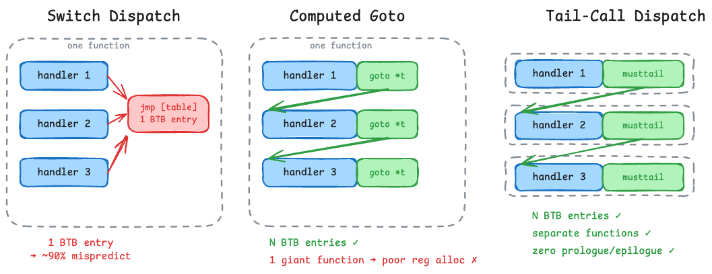

Beating a JIT Compiler with an Interpreter

## Introduction

The interpreter discussed in this article is [Silverfir-nano](https://github.com/mbbill/Silverfir-nano). On the Apple M4, it outperforms Wasmtime's baseline JIT compiler ([Winch](https://github.com/bytecodealliance/rfcs/blob/main/accepted/wasmtime-baseline-compilation.md)) on CoreMark and Lua Fibonacci, and reaches ~62% of the optimizing Cranelift JIT on CoreMark. To be fair, Winch is designed as a baseline compiler that prioritizes compilation speed over peak runtime performance, and the average across all tested workloads still falls behind Winch — but even so, a pure interpreter beating any JIT compiler on compute-heavy benchmarks is a notable result. I haven't been able to find another interpreter with performance that comes close. The current second-fastest is wasm3, which reaches roughly 46% of Silverfir-nano's CoreMark score. The rest fall below half. So it is likely the fastest WebAssembly interpreter at this point — though I haven't profiled every scenario, and the interpreter lacks SIMD support, so it may not lead on every workload.

The core interpreter is around 230 KB stripped (without WASI, std, or fusion), scaling to ~3 MB with the full 1,500-pattern fusion set and WASI support. I think this is a reasonable footprint for an embedded-friendly build.






This post records what I learned while building a fast WebAssembly interpreter on modern CPU architectures. Most of the techniques are not WebAssembly-specific — they apply to interpreter design in general.

**What is new here?** The dispatch techniques in Part I (tail-call, `musttail`, `preserve_none`) are well-known individually — Josh Haberman's [musttail blog post](https://blog.reverberate.org/2021/04/21/musttail-efficient-interpreters.html) and the CPython 3.14 tail-call interpreter cover them well. TOS register caching also has prior art in wasm3. The novel contributions of this work are:

1. **The argument for staying stack-based instead of converting to a register machine**, specifically because stack-machine fusion is trivially automatable and allows the C compiler to optimize across instruction boundaries — benefits that register-machine fusion cannot easily replicate (Part III).
2. **The combination of TOS register window + `preserve_none` + tail-call dispatch**, which keeps the top-of-stack values in physical hardware registers across the entire handler chain with zero memory traffic (Part IV).
3. **Next-handler preloading with guard-check dispatch**, which hides load-to-use latency by pipelining the handler pointer one step ahead (Part V).
4. **The L0 local register cache**, which promotes the hottest local variable into a hardware register and makes it a first-class participant in the fusion system — so that fused l0 operations compile to zero instructions (Part VI).

Before we get into the details, all of the optimizations in this article come down to four goals:

- Make good use of the modern CPU's microarchitecture.
- Reduce the number of dispatches.
- Keep everything in registers and avoid memory stalls.
- Push the number of instructions inside each handler body to the minimum.

Keep these in mind as we go through each section.

## Part I: Interpreter Dispatch

The first question when building an interpreter is how to dispatch. There are only a handful of options, each with distinct trade-offs.

**Switch dispatch** is what most interpreters use: a giant `switch` over the opcode, typically compiled to a jump table for dense values (O(1) dispatch). However, WebAssembly opcodes aren't entirely dense — the 0xFC and 0xFD prefixes create sparse regions that may force the compiler to fall back to binary search. More importantly, all dispatches funnel through a single indirect jump instruction, which puts enormous pressure on the CPU's Branch Target Buffer (BTB). The BTB caches the target address of recently taken branches to enable speculative execution. With only one dispatch point, the BTB entry is constantly overwritten with different targets, making prediction nearly impossible.

**Computed goto** improves the BTB situation: each handler gets its own copy of the indirect jump, so the BTB can learn per-handler patterns (e.g., "after `i32.add`, the next instruction is usually `local.set`"). Classic research by Ertl and Gregg showed that switch dispatch suffers 95%+ branch misprediction, and threaded dispatch brings it down to roughly 50–60%. However, all goto labels must live inside one function, turning the interpreter loop into a single giant function body. This leads to poor register allocation and instruction cache pressure. Another option is function pointers in the dispatch table, but that introduces calling convention overhead (callee-saved register spills, stack arguments) that computed goto avoids.

**Tail-call dispatch** goes further. Each handler is a separate function that tail-calls the next handler directly. Like computed goto, each handler gets its own BTB entry. But because each handler is an independent function, the compiler can optimize them individually, avoiding the giant-function problem entirely. My profiling on macOS (Instruments) and Windows (VTune) shows both platforms can achieve >95% branch prediction success. Modern CPUs use advanced indirect branch predictors like ITTAGE that correlate predictions with path history — as long as each dispatch gets its own branch instruction, the predictor runs happily.



There are two catches to make tail-call dispatch work in practice:

**First, tail calls must be guaranteed.** Regular tail-call optimization is best-effort — the compiler may silently emit a `call` instead of a `jmp`, and the interpreter will instantly stack overflow. With LLVM/Clang we have `__attribute__((musttail))` (or `[[clang::musttail]]` in C++) which provides a hard guarantee: either the compiler emits a proper tail call, or it produces a compile-time error. GCC 15 added the equivalent `[[gnu::musttail]]`. For `musttail` to succeed, the caller and callee must have the same return type and calling convention, there must be no non-trivial destructors or cleanup in scope, and all arguments must fit the target ABI's constraints. If any of these are violated, the compiler rejects the code at compile time rather than silently falling back — which is exactly what we want.

**Second, prologue and epilogue must be eliminated.** Each handler is a function, and under a standard calling convention the compiler will emit register save/restore code in the prologue and epilogue. In short: some registers are "callee-saved" (the function must preserve them), and some are "caller-saved" (the caller saves them before calling). The prologue pushes callee-saved registers to the stack; the epilogue pops them back. For a tiny handler that just does one add and jumps to the next instruction, this overhead can easily dwarf the actual work. To avoid this, we need two things. First, all general-purpose registers should be caller-saved so that the callee never needs to save anything. This is exactly what `preserve_none` provides — an LLVM/Clang calling convention (`__attribute__((preserve_none))`) that makes all GP registers caller-saved. On x86-64, only RSP and RBP are callee-preserved; everything else (RDI, RSI, RDX, RCX, R8–R15, RAX) becomes available for argument passing. On AArch64, similarly most registers become available. Second, handlers must be leaf functions — no outgoing calls that would force the caller to save registers. With these two rules in place, every handler compiles to a function with zero prologue and zero epilogue, and all arguments live in hardware registers:

- `preserve_none` calling convention
- Handlers are leaf functions

This is what a real handler function signature looks like in Silverfir-nano:

```c
PRESERVE_NONE
typedef void (*OpHandler)(
    struct Ctx*         ctx,   // execution context
    struct Instruction* pc,    // current instruction pointer
    uint64_t*           fp,    // frame pointer (locals)
    uint64_t  l0,              // hot local register 0
    uint64_t  l1,              // hot local register 1
    uint64_t  l2,              // hot local register 2
    uint64_t  t0,              // TOS register 0
    uint64_t  t1,              // TOS register 1
    uint64_t  t2,              // TOS register 2
    uint64_t  t3,              // TOS register 3
    NextHandler nh             // preloaded next handler
);
```

Eleven arguments, all in registers thanks to `preserve_none`. We will use every single one of them.

### Aside: Why Not Pure Rust?

Astute readers will have noticed we are deep in C territory despite the title mentioning Rust. The project is 91% Rust, but the hot dispatch loop is in C because `musttail` and `preserve_none` do not exist in stable Rust. Rust nightly has `become` (explicit tail calls via `#![feature(explicit_tail_calls)]`) which maps to LLVM's `musttail`, but it is still unstable and incomplete, and there is no `preserve_none` equivalent yet. Once both features stabilize, the project can become 100% pure Rust.

Currently, a trampoline bridges Rust to C, and the hot path runs in pure C. Non-C handlers incur a function call from the C wrapper to the Rust implementation, which is slower. Cross-language LTO can help, but in practice the hot path is almost always simple arithmetic, so this is acceptable.

## Part II: Designing for WebAssembly

With the dispatch infrastructure in place, let's talk about how to apply it to WebAssembly.

### The Instruction Distribution Problem

WebAssembly is a stack machine, and the runtime distribution of instructions is quite different from what the spec might suggest. Profiling two LLVM-compiled workloads (fusion disabled) tells a consistent story: `local.get` alone accounts for roughly 26% of all dispatched instructions, with `local.set` and `local.tee` adding another 12%. In both CoreMark (307M dispatches) and Lua fib (526K dispatches), local variable access accounts for approximately 38% of all dispatches. Block structure instructions (`block`, `end`, `loop`) and control flow (`br`, `br_if`) take another large chunk. The actual arithmetic — the instructions that do real work — usually accounts for less than 40% of total dispatch.

A naive interpreter that dispatches every WebAssembly instruction one-to-one will spend most of its time on overhead. The question becomes: how can we reduce the number of dispatched instructions? For `block`, `end`, and `loop`, it's easy — just eliminate them during compilation. But what about `local.get` and `local.set`?

### The Register Machine Approach

One approach is to convert the stack machine into a register machine at compile time. Most modern compilers work on an SSA (Static Single Assignment) intermediate representation, where every variable is assigned exactly once, making data flow explicit and enabling a wide range of optimizations. WebAssembly locals are the only values that can be written multiple times; stack values are implicitly SSA. If we convert locals into SSA form, we can assign virtual register indices to everything. I originally found this trick in wasm3, which uses a copy-on-write scheme to allocate virtual registers: when a local is read, it shares the existing register, and only when a local is written does it get a fresh slot. With this trick, `local.get` effectively disappears and `local.set` becomes a register-to-register copy. Because WebAssembly is statically verifiable, the stack height at each instruction is known at compile time — so instead of `sp[top]`, we can use `regs[imm]` where `imm` is a compile-time constant offset. This is smart because now all instructions work on virtual registers indexed by immediates.

### Why We Chose to Stay Stack-Based

However, this approach has significant costs, and I chose not to go this way. There are two main issues.

**Issue 1: Memory stall.** The "virtual" registers aren't in physical registers — they live in memory. Each handler must load operands from memory and store results back, creating load-to-use and store-to-load latency chains. For example, `c = add(a, b)` requires loading both `a` and `b` before the add can execute, then immediately storing the result which will likely be loaded again by the next instruction. Wasm3 maps one register to a physical register, but this is nothing like a real register allocator that computes liveness and looks ahead. Very few optimizations can be done to make these mappings effective.

**Issue 2: Fusion becomes much harder to automate.** This is the more subtle problem. Register-based interpreters can and do fuse instructions — LuaJIT fuses compare-and-branch, wasm3 has peephole-optimized fused opcodes — but the automation story is fundamentally different from a stack machine.

On a stack machine, fusing N instructions is straightforward: concatenate the handler bodies, and the C compiler sees through the compile-time-constant stack offsets to eliminate intermediate loads and stores automatically. A code generator can produce hundreds of fused handlers and let the compiler do the optimization work.

On a register machine, naively concatenating handlers still saves one dispatch, but the compiler cannot optimize across the fused boundary — register indices are loaded from different memory addresses at runtime, creating aliasing barriers that prevent the compiler from proving that one instruction's output feeds into the next instruction's input. To get real optimization benefit (eliminating intermediate register-file accesses), you would need to either detect data dependencies at compile time and emit specialized fused opcodes, or write each optimized fused handler by hand. Both approaches face a combinatorial explosion: each instruction carries 2–3 register operands as immediates, so the number of operand patterns grows exponentially with fusion length. The wasm3 interpreter documents this directly — adding a single meta-machine register increased handler variants per opcode from 3 to 10. This is why every register-based interpreter that performs fusion uses a small number of carefully hand-selected patterns rather than automated generation. We will explore this in detail next.

## Part III: Instruction Fusion

Now that we've chosen to stay with the stack machine model, let's talk about the key optimization that makes it all work: instruction fusion.

### What Is Fusion?

The idea is straightforward: instead of dispatching each Wasm instruction one at a time, we fuse N consecutive instructions into a single handler. This reduces the number of dispatches — the core overhead of any interpreter — and also enables the C compiler to optimize across instruction boundaries within each fused handler.

### Instruction Encoding: Wide and Wasteful — Until Fusion Fills It

Each instruction in Silverfir-nano is encoded as 4×64-bit words (32 bytes): one word holds the handler function pointer, and the remaining three are immediate slots that handlers can use freely for operands — local indices, constants, branch targets, memory offsets, or any other data the instruction needs.

This looks wasteful. A simple `i32.add` needs zero immediates; a `local.get` needs one. Most individual WebAssembly instructions use at most one or two, leaving the rest empty. Compared to variable-length encodings, we are burning 4× the memory per instruction.

But this is exactly where fusion turns the design from wasteful to efficient. The fusion system filters candidate patterns by immediate capacity: any sequence whose combined immediates exceed three slots is rejected during discovery. This means every fused pattern that makes it into the final instruction set is *guaranteed* to fit in the fixed encoding — and because fused patterns pack multiple instructions' operands into those three slots, the slots are well-utilized. A 3-instruction fusion like `get_const_add` uses all three immediates (local index, constant, and the stack offset encoded by the TOS system). A 5-instruction fusion might share constant fields or reuse slots. The longer the fusion, the more densely packed the encoding becomes.

The result is that after fusion compresses an instruction sequence — eliminating roughly two-thirds of dispatches — the remaining instructions have their immediate slots filled rather than wasted. The instruction stream becomes dense despite the wide per-instruction format.

There is also a microarchitectural benefit: 32 bytes per instruction means two instructions fit exactly in a 64-byte cache line, giving clean alignment with no straddling or padding waste.

### Why Stack Machines Fuse Better

Consider three consecutive `i32.ctz` instructions. On a **stack machine**, each handler reads from and writes to `sp[top]`, which is a compile-time known address:

```
// Three separate handlers:           // Fused into one handler:
value = sp[top];                       sp[top] = ctz(ctz(ctz(sp[top])));
cnt = ctz(value);                      pc += 3;
sp[top] = cnt;
pc += 1;
// ... repeated 3 times
```

Because `sp[top]` is a compile-time constant, the compiler can see that all three handlers read and write the same location. It collapses the entire sequence into a single `ctz(ctz(ctz(...)))` chain — one load, one store. If `sp[top]` is mapped to a TOS register, it becomes zero memory operations.

Now consider the same fusion on a **register machine**, where operands are addressed by indices loaded from the instruction stream:

```
// Three fused handlers:
dst = pc->imm0; src = pc->imm1;
regs[dst] = ctz(regs[src]); pc += 1;
dst = pc->imm0; src = pc->imm1;
regs[dst] = ctz(regs[src]); pc += 1;
dst = pc->imm0; src = pc->imm1;
regs[dst] = ctz(regs[src]); pc += 1;
```

Although we know that the three `dst`/`src` may refer to the same register slot, the compiler does not — they are loaded from different memory addresses, so the compiler must assume they could alias. None of the loads or stores can be optimized away. Worse, each store to `regs[]` may alias the next load, creating a serialized dependency chain.

We can verify this with a concrete test ([godbolt link](https://godbolt.org/z/ca3bssvbh)). Here are three C functions representing the stack-machine, register-machine, and TOS-register approaches:

```c
// Case 1: Stack machine — sp[top] is compile-time constant
void fused_ctz_stack(uint64_t* sp) {
    const int top = 3;
    sp[top] = __builtin_ctz((uint32_t)sp[top]);
    sp[top] = __builtin_ctz((uint32_t)sp[top]);
    sp[top] = __builtin_ctz((uint32_t)sp[top]);
}

// Case 2: Register machine — indices loaded from instruction stream
void fused_ctz_register(uint64_t* regs,
                        const uint64_t* __restrict__ imms) {
    regs[imms[0]] = __builtin_ctz((uint32_t)regs[imms[1]]);
    regs[imms[2]] = __builtin_ctz((uint32_t)regs[imms[3]]);
    regs[imms[4]] = __builtin_ctz((uint32_t)regs[imms[5]]);
}

// Case 3: TOS register — stack top lives in a register argument
uint64_t fused_ctz_tos(uint64_t t0) {
    t0 = __builtin_ctz((uint32_t)t0);
    t0 = __builtin_ctz((uint32_t)t0);
    t0 = __builtin_ctz((uint32_t)t0);
    return t0;
}
```

Compiled with `clang -O3` on x86-64, the results speak for themselves:

```asm
fused_ctz_stack:                    # 1 load, 3x ctz, 1 store
    rep bsf  eax, dword ptr [rdi + 24]
    rep bsf  eax, eax
    rep bsf  eax, eax
    mov  qword ptr [rdi + 24], rax
    ret

fused_ctz_register:                 # 3x (load idx, load val, ctz, store) — serialized
    mov  rax, qword ptr [rsi + 8]
    rep bsf  eax, dword ptr [rdi + 8*rax]
    mov  rcx, qword ptr [rsi]
    mov  qword ptr [rdi + 8*rcx], rax
    mov  rax, qword ptr [rsi + 16]
    mov  rcx, qword ptr [rsi + 24]
    rep bsf  ecx, dword ptr [rdi + 8*rcx]
    mov  qword ptr [rdi + 8*rax], rcx
    mov  rax, qword ptr [rsi + 32]
    mov  rcx, qword ptr [rsi + 40]
    rep bsf  ecx, dword ptr [rdi + 8*rcx]
    mov  qword ptr [rdi + 8*rax], rcx
    ret

fused_ctz_tos:                      # Pure register — zero memory access
    rep bsf  eax, edi
    rep bsf  eax, eax
    rep bsf  eax, eax
    ret
```

The stack-machine version compiles to 5 instructions (1 load, 3 `ctz`, 1 store). The register-machine version compiles to 15 instructions — three separate load-compute-store sequences that the compiler cannot merge. The TOS register version compiles to just 3 `ctz` instructions with zero memory access — this is what Silverfir-nano's TOS window achieves.

To be clear, register-based interpreters can still benefit from fusion — combining two instructions into one handler saves one dispatch regardless of the IR model. But the optimization *beyond* dispatch reduction — eliminating intermediate memory operations, letting the compiler chain computations into a single load-compute-store sequence — is where the stack machine pulls ahead. On a register machine, achieving similar cross-instruction optimization would require hand-writing each fused handler to encode the expected data-flow pattern, or generating specialized variants for each combination of register operands. In practice, this combinatorial explosion is why no register-based interpreter uses automated superinstruction generation.

### Fusing Away local.get

You may wonder: if we stay stack-based, how do we deal with the `local.get` overhead? This is where fusion shines. Although the WebAssembly instruction set is large, in practice the instructions that follow `local.get` come from a small, predictable subset. Profiling two workloads without fusion reveals what comes next:

| Rank | Instruction after `local.get` | CoreMark (% of `local.get`) | Lua fib (% of `local.get`) |
|------|-------------------------------|:---------------------------:|:--------------------------:|
| 1 | `i32.const` | 30.8% | 31.8% |
| 2 | `local.get` | 20.7% | 21.5% |
| 3 | `i32.load` / `i32.load8_u` | 9.9% | 11.4% |
| 4 | `local.set` | 7.5% | 2.1% |
| 5 | `i32.store` | 3.6% | 4.2% |
| 6 | `i32.mul` / `i32.add` | 3.4% | 2.6% |
| 7 | `local.tee` / `i32.load` | 3.4% | 11.2% |
| 8 | `br_if` | 3.3% | 4.3% |
| 9 | `i32.add` / `local.set` | 3.0% | 2.1% |
| 10 | `i32.load8_u` / `i32.eqz` | 2.6% | 1.9% |
| | **Top 10 cumulative** | **88.2%** | **92.3%** |

The distribution is remarkably consistent: across both an integer-heavy benchmark (CoreMark, 307M dispatches) and a call-heavy recursive workload (Lua fib, 525K dispatches), the top 10 instructions after `local.get` account for 88–92% of all `local.get` occurrences. Fusing `local.get` with just these 10 instructions eliminates the vast majority of `local.get` dispatches. We simply generate a fused handler for each pair — `get_const`, `get_get`, `get_load`, and so on — and the `local.get` disappears into the fused handler. The same analysis applies to `local.set`, `i32.const`, and other high-frequency instructions.

We are not limited to two-instruction pairs. Longer sequences can be fused as well — for example, `local.get` + `i32.const` + `i32.add` + `local.set` + `local.get` becomes a single `get_const_add_set_get` handler that eliminates 4 dispatches per execution. The full fusion set includes over 1,500 patterns, and the savings compound: fusion eliminates roughly two-thirds of all dispatches in CoreMark. Silverfir-nano includes an automatic profiling tool (`discover-fusion`) that profiles a Wasm binary and discovers fusion candidates above a configurable threshold. In most cases custom profiling won't improve much over the built-in patterns, because nearly everyone uses LLVM to generate Wasm binaries, and the LLVM Wasm backend produces consistent instruction sequences.

## Part IV: TOS Register Window

The fusion story is looking good, but there is still a problem: even though the stack pointer `sp` itself lives in a register, the stack memory it points to does not. Every handler still needs to load from and store to memory through `sp`, creating memory stalls.

### Mapping Stack to Registers

WebAssembly's static verifiability gives us a powerful tool: the stack height at each instruction is known at compile time. This means that if we define a window of N stack slots mapped to hardware registers, we know at compile time exactly which register each instruction will access.

For instance, suppose the top three stack slots are mapped to registers r0–r2:

```
Stack: [ ... | sp-2 | sp-1 | sp ]
              r0      r1     r2
```

If the next instruction is `i32.ctz`, we know at compile time that it operates on r2. So we emit a handler variant `i32_ctz_r2(r0, r1, r2)`. Inside that handler, the body is just `ctz(r2)` — a pure register operation. The actual handler body is a single arithmetic instruction.

Here is what a real handler implementation looks like:

```c
// IMPL_PARAMS_POP1_PUSH1 expands to:
//   struct Ctx* ctx, struct Instruction* pc, uint64_t** pfp,
//   uint64_t* p_src, uint64_t* p_dst

FORCE_INLINE struct Instruction* impl_i32_ctz(IMPL_PARAMS_POP1_PUSH1) {
    (void)ctx; (void)pfp;
    *p_dst = SEM_I32_CTZ(*p_src);
    return pc_next(pc);
}
```

The first three parameters (`ctx`, `pc`, `pfp`) are the base context shared by all handlers. The `p_src` and `p_dst` pointers are what make the TOS window work — they are passed in by the generated wrapper, and because of `preserve_none`, they point directly to the TOS register arguments (`&t0`, `&t1`, `&t2`, or `&t3` depending on the variant). The "memory" access through the pointer is actually a register access. The compiler inlines this, and the result is a single instruction in the generated assembly.

When an operation pushes or pops values outside the current window, the compiler emits spill or fill instructions to move data between registers and the frame:

```c
// Spill: write TOS register to frame memory
// IMPL_PARAMS_POP1 expands to:
//   struct Ctx* ctx, struct Instruction* pc, uint64_t** pfp,
//   uint64_t* p_src

FORCE_INLINE struct Instruction* impl_spill_1(IMPL_PARAMS_POP1) {
    (void)ctx;
    uint16_t s = spill_1_decode_slot(pc);
    fp[s] = *p_src;
    return pc_next(pc);
}
```

Profiling CoreMark with fusion enabled (189M dispatched instructions) shows that TOS management overhead is small:

| | Count | % of dispatches |
|---|---------|-----------------|
| spill_1 | 2,846,483 | 1.51% |
| spill_2 | 238,842 | 0.13% |
| spill_3 | 799,715 | 0.42% |
| **Total spills** | **3,885,195** | **2.06%** |
| fill_1 | 1,220,635 | 0.65% |
| fill_2 | 748,370 | 0.40% |
| **Total fills** | **1,969,007** | **1.04%** |
| **Combined** | **5,854,202** | **3.10%** |

Fills account for only 1% of dispatches. Spills are dominated by `spill_1` (single-value). The combined overhead of 3.1% is modest — for every 100 handler dispatches, only 3 are spent on TOS window management. LLVM does a good job keeping hot values in a small stack region, which makes this design efficient.

### Passing TOS as Function Arguments

How do we keep the TOS values in hardware registers across handlers? Simple: we pass them as function arguments. With tail-call dispatch and `preserve_none`, all function arguments are registers, passed in a fixed order.

The linear nature of a stack machine makes this elegant: we only need to generate N variants of each handler (one per TOS depth level). A full register-machine approach would need a permutation of N registers, which explodes combinatorially.

This is where the two rules from Part I pay off. `preserve_none` ensures that function arguments live in hardware registers with no save/restore overhead. Tail-call ensures that those register values flow directly from one handler to the next without touching the stack. The combination means our TOS values stay in physical hardware registers across the entire execution chain — zero memory traffic for in-window operations.

## Part V: Next-Handler Preloading

### The New Bottleneck

At this point, if we look at any typical handler, the body is just one arithmetic operation plus the dispatch to the next handler. After all our previous optimizations, dispatch overhead becomes the dominant cost — and the bottleneck is the **load-to-use latency** of fetching the next handler's function pointer from memory.

The typical dispatch sequence looks like:

```asm
ldr r0, [next_addr]    ; load next handler pointer
add ...                 ; actual work (just one instruction)
jmp r0                  ; jump to next handler
```

The CPU cannot execute `jmp r0` until `r0` is loaded, creating a pipeline stall. After our optimizations, there is almost nothing between the load and the jump for the CPU to work on in parallel.

### Guard-Check Dispatch

The solution is to preload the handler pointer one step ahead. Each handler receives the next handler's pointer (`nh`) as a function argument — already loaded by the *previous* handler. While the current handler executes its work, it simultaneously loads the handler for the instruction *after* the next one (`new_nh`), giving the CPU a full handler's worth of time to hide the latency.

Here is the actual generated dispatch code:

```c
// After impl_* computes np (the next instruction to execute):
NextHandler new_nh = (NextHandler)pc_next(np)->handler;   // preload one ahead
if (likely(np == pc_next(pc))) {
    __attribute__((musttail)) return ((OpHandler)nh)(ARGS_NEXT);  // linear: use preloaded nh
} else {
    __attribute__((musttail)) return np->handler(ARGS_NEXT);      // branch/trap: reload
}
```

This may look like more work — we are loading an additional pointer from memory *and* adding a conditional branch. But the key insight is that the compiler eliminates both for the common case:

- Most handlers are **always-linear**: their `impl_*` function always returns `pc_next(pc)`. The compiler inlines the impl, sees that `np == pc_next(pc)` is always true, and eliminates the branch entirely. The handler simply tail-calls through the preloaded `nh` — zero-latency dispatch. Here is the actual disassembly of `op_i32_add_D2` on AArch64:

```asm
op_i32_add_D2:
    mov  x2, x1           ; save preloaded nh to x2
    add  w26, w27, w26    ; the actual work: t0 = t1 + t0
    ldr  x1, [x21, #0x40] ; preload new_nh = pc_next(np)->handler
    add  x21, x21, #0x20  ; advance pc (each instruction is 32 bytes)
    br   x2                ; tail-call to next handler via preloaded nh
```

Five instructions. One `add` for the actual work, the rest is dispatch. No branch, no guard check, no prologue, no epilogue. The guard was eliminated entirely because the compiler proved this handler always returns `pc_next(pc)`. The four TOS registers (`x26`–`x28`, `x0`), three hot local registers (`x23`–`x25`), frame pointer (`x22`), and program counter (`x21`) all live in hardware registers across the call, with `x1` carrying the preloaded next-handler pointer — exactly the `nh` argument from the function signature.

- For **potentially-branching** handlers (like `br_if`), the guard is kept. The `likely` hint tells the branch predictor that the linear path is the common case. On the fast path, we still use the preloaded `nh`; only on taken branches do we reload from `np->handler`.

- For **always-nonlinear** handlers (like `br`, `return`, `call`), the preload guard is skipped entirely — they always reload from `np->handler`:

```c
(void)nh;  // discard preloaded handler
NextHandler new_nh = (NextHandler)pc_next(np)->handler;
__attribute__((musttail)) return np->handler(ARGS_NEXT);
```

This three-tier dispatch strategy is generated automatically by the build system. The code generator (`gen_c_wrappers.rs`) templates every handler with the appropriate dispatch pattern based on handler metadata. No manual work is needed.

## Part VI: Hot Local Register Cache (L0/L1/L2)

### The Remaining Memory Traffic

After all the optimizations so far — fusion eliminates dispatches, the TOS window keeps stack values in registers, and handler preloading hides dispatch latency — where does the remaining memory traffic come from?

The answer is local variables. Even inside fused handlers, every `local.get` and `local.set` translates to a frame memory access: `fp[idx]`. Fusion eliminates the *dispatch overhead* of local access, but the memory traffic remains — the fused handler body still loads from and stores to `fp[idx]` for every local operation. Recall from Part II that local variable access accounts for approximately 38% of all dispatched instructions. After fusion absorbs those dispatches, the memory operations they carried are still there, now embedded inside fused handler bodies.

### The Observation

Not all locals are equally hot. In practice, most functions have a small number of locals that dominate access counts — typically loop counters, accumulators, and index variables. If we could keep the hottest locals in hardware registers, we would eliminate a disproportionate share of frame memory traffic.

### The Hot Local Registers (L0/L1/L2)

The idea is simple: add three registers (`l0`, `l1`, `l2`) to the handler signature that cache the three hottest local variables. These registers are passed through the entire handler chain as function arguments — just like the TOS registers and the frame pointer — so they live in physical hardware registers at all times.

The challenge is that the hot locals are not always at indices 0, 1, 2. A function's hottest local might be parameter 2, or local variable 5. To make this work, we need two pieces:

**Compile-time hot local analysis.** At compile time, we walk the raw Wasm bytecode and count local variable accesses weighted by loop nesting depth. Each access inside a loop multiplies the weight by 10 per nesting level — so a `local.get` inside a double-nested loop counts 100x more than one outside any loop. The top three locals by weight become l0, l1, and l2. This is a simple single-pass analysis over the bytecode, with no control flow graph or SSA needed.

**Index swap at function entry.** The function prologue emits swap instructions that remap the hot locals to indices 0, 1, 2 and loads them into the `l0`, `l1`, `l2` registers. From that point on, all references to the original hot locals go through register access (`local_get_l0`, `local_get_l1`, `local_get_l2`), while the displaced original locals at indices 0–2 use the remapped indices (frame memory). The compiler handles this remapping transparently at compile time.

The key properties:

- **The local registers are orthogonal to the TOS window.** They do not increase the number of handler variants — they are simply additional arguments in the handler signature, alongside the TOS registers.
- **Spill and fill are folded into existing call/return handlers.** Before a call, `fp[0..2] = l0, l1, l2`. After a return, `l0, l1, l2 = fp[0..2]`. No separate spill/fill instructions needed.
- **Local register ops are first-class in the fusion system.** `local_get_l0`, `local_set_l1`, `local_tee_l2`, etc. all participate in fusion discovery and pattern matching just like any other instruction.

### Fusion Makes Local Register Access Free

This is where the local register cache becomes truly powerful. When l0/l1/l2 operations are fused with arithmetic, the compiler *completely eliminates* the local access — it becomes a register-to-register copy that costs zero instructions.

Consider a common pattern: `local.get → i32.add → local.set` — incrementing a loop counter. Without a local register, the fused handler still needs frame loads and stores:

```c
// Without L0: hot local lives in fp[idx] (memory)
void no_l0(uint64_t* fp, uint16_t idx, uint32_t K) {
    uint32_t val = (uint32_t)fp[idx];    // LOAD from frame
    fp[idx] = (uint64_t)(val + K);       // STORE to frame
}

// With L0: hot local is a register argument
uint64_t with_l0(uint64_t l0, uint32_t K) {
    return (uint64_t)((uint32_t)l0 + K); // pure register arithmetic
}
```

Compiled with `clang -O3` on AArch64 (Apple M4), the results speak for themselves:

```asm
; Without L0: 3 instructions, 2 memory accesses
no_l0:
    ldr  x8, [x0, w1, uxtw #3]    ; load fp[idx]
    add  w8, w8, w2                ; add K
    str  x8, [x0, w1, uxtw #3]    ; store fp[idx]
    ret

; With L0: 1 instruction, zero memory access
with_l0:
    add  w0, w0, w1                ; that's it
    ret
```

The `local_get_l0` and `local_set_l0` have been completely eliminated. What remains is the pure computation — a single `add`.

Longer fusions with multiple local registers show even more dramatic results. Consider a 6-instruction Wasm sequence common in hash and accumulator loops: `local_get_l0 → local_get_l1 → i32.xor → local_get_l2 → i32.add → local_set_l0` — XOR two state variables, add a third, and write back:

```c
// Without local registers: 3 loads + 1 store (6 instructions)
void no_cache(uint64_t* fp, uint16_t a, uint16_t b, uint16_t c) {
    uint32_t x = (uint32_t)fp[a];
    uint32_t y = (uint32_t)fp[b];
    uint32_t z = (uint32_t)fp[c];
    fp[a] = (uint64_t)((x ^ y) + z);
}

// With local registers: pure register arithmetic (2 instructions)
uint64_t with_cache(uint64_t l0, uint64_t l1, uint64_t l2) {
    return (uint64_t)(((uint32_t)l0 ^ (uint32_t)l1) + (uint32_t)l2);
}
```

```asm
; Without local registers: 6 instructions, 4 memory accesses
no_cache:
    ldr  x8, [x0, w1, uxtw #3]    ; load fp[a]
    ldr  x9, [x0, w2, uxtw #3]    ; load fp[b]
    ldr  x10, [x0, w3, uxtw #3]   ; load fp[c]
    eor  w8, w8, w9                ; x ^ y
    add  w8, w8, w10               ; + z
    str  x8, [x0, w1, uxtw #3]    ; store fp[a]
    ret

; With local registers: 2 instructions, zero memory access
with_cache:
    eor  w8, w0, w1                ; l0 ^ l1
    add  w0, w8, w2                ; + l2
    ret
```

Six Wasm instructions, two machine instructions, zero memory access. Three local reads and one local write — all four frame memory operations — have been completely eliminated. The `local_get_l0`, `local_get_l1`, `local_get_l2`, and `local_set_l0` do not exist in the generated code. They were register-to-register copies that the compiler folded into the operands of the arithmetic instructions.

This is only possible because local register ops are first-class participants in the fusion system. The fusion discovery tool (`discover-fusion`) profiles workloads and automatically discovers patterns containing l0/l1/l2 ops alongside regular arithmetic and control flow. The code generator then produces fused C handlers where local register reads and writes are expressed as `*p_l0`, `*p_l1`, `*p_l2` — pointers to the caller's register arguments. After inlining, the compiler sees through the pointers and treats them as direct register accesses. The same zero-cost elimination shown above for l0 applies identically to l1 and l2.


## Conclusion

All of the optimizations in this article come down to the four goals stated in the introduction: use the modern CPU well, reduce dispatches, keep values in registers, and minimize handler bodies. Each technique addresses a different subset of these goals — tail-call dispatch and next-handler preloading target the CPU microarchitecture, instruction fusion reduces dispatches, the TOS register window keeps stack values in hardware registers, the L0/L1/L2 cache keeps the hottest locals in registers, and `preserve_none` with leaf functions minimizes handler bodies to near-zero overhead. Together, they reinforce each other: fusion creates larger handlers that the TOS window and local register cache can operate on entirely in registers, while preloading hides the dispatch latency between them.

From building this interpreter I noticed that many of the things we used to believe about CPU performance aren't true anymore. Branch prediction on modern CPUs is so good that as long as you don't overload the BTB, indirect branches are nearly free. The CPU's out-of-order execution is so effective that memory stalls like load-to-use can be mitigated simply by separating the load and use far enough apart. However, Instruments and VTune show that the dispatch rate is still far from the theoretical maximum, which suggests there is room to improve.

### Limitations

The benchmark results reported here are from CoreMark on Apple M4. Performance characteristics may differ on other architectures (x86-64, other ARM cores) and other workload profiles. In particular:

- **Floating-point heavy workloads** have not been extensively profiled. The TOS register scheme uses 64-bit integer registers; floating-point values are bit-cast through them, which may not be optimal on all platforms.
- **Branch-heavy code** (deeply nested control flow, frequent `br_table`) may benefit less from fusion and TOS caching, since branches break the linear dispatch chain and invalidate preloaded handlers.
- **SIMD** is not yet implemented. Workloads that rely on vector operations will not benefit from these optimizations.

More benchmarking across architectures and workload types is needed, and I plan to publish those results separately.

## Acknowledgments

Thanks to the authors and communities behind wasm3, WAMR, and wasmi — all prior art that gave me tons of inspiration.
